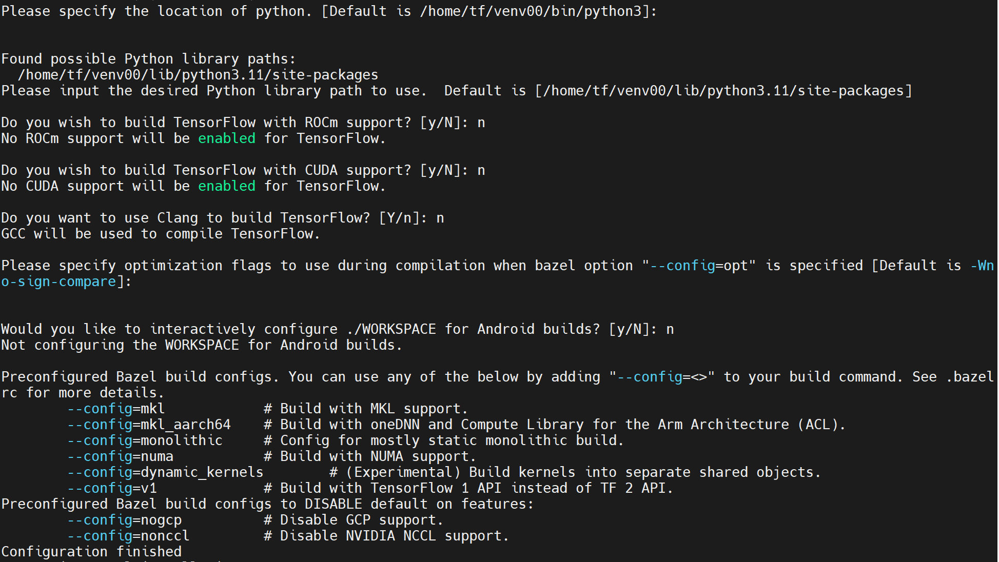
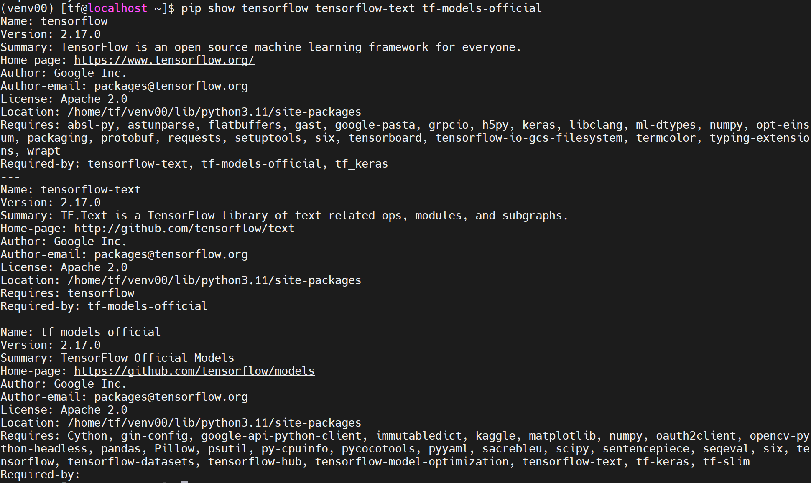

# Tensorflow-2.17.0 ARM 构建

```
# 切换到 /usr/bin/ 目录
cd /usr/bin/

# 创建符号链接
sudo ln -s aarch64-openEuler-linux-gcc aarch64-linux-gnu-gcc

# 安装基本的工具
sudo dnf install patchelf openssl-devel libffi-devel hdf5-devel bazel -y
```

运行脚本tensorflow2170-arm_build.sh

构建过程中的配置如下



通过运行 `pip show tensorflow tensorflow-text tf-models-official`来验证构建是否完成


