# Tensorflow-2.17.0 ARM 测试

注意：路径应该切换为自己的路径，不能直接复制粘贴使用

下面的测试文档是基于tf-2.15.0写的，由于时间原因，我在tf-2.17.0上只测试了部分用例。可能会存在tf版本升级，用例运行异常的情况出现。

## examples

> github：https://github.com/tensorflow/examples

该仓库在tensorflow_examples/models/路径下有dcgan、densenet、nmt_with_attention和pix2pix共四个模型，下面分别进行测试。

首先克隆仓库并设置环境变量 `PYTHONPATH`，如下：

```
//克隆仓库
git clone https://github.com/tensorflow/examples
//把examples仓库添加到PYTHONPATH环境变量中
export PYTHONPATH="$PYTHONPATH:/home/tf-test/file/examples"
```

### dcgan

[dcgan](https://github.com/tensorflow/examples/tree/master/tensorflow_examples/models/dcgan)有train和eval的文件，这里进行train。

```
python dcgan.py
```

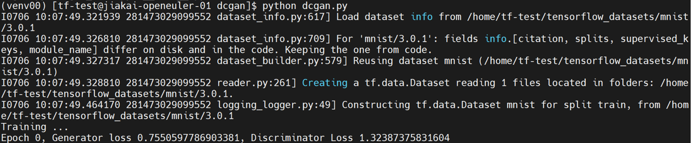

### densenet

[densenet](https://github.com/tensorflow/examples/tree/master/tensorflow_examples/models/densenet)有train和eval的文件，这里进行train。

```
python train.py
```

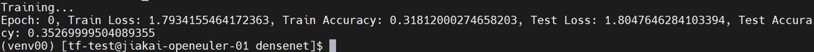

### nmt_with_attention

[nmt_with_attention](https://github.com/tensorflow/examples/tree/master/tensorflow_examples/models/nmt_with_attention)有train和eval的文件，这里进行train。

```
python train.py
```

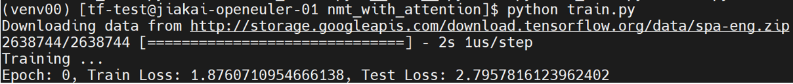

### pix2pix

[pix2pix](https://github.com/tensorflow/examples/tree/master/tensorflow_examples/models/pix2pix)有train和eval的文件，这里进行train。

下载数据集[facades](https://www.kaggle.com/datasets/vikramtiwari/pix2pix-dataset?resource=download-directory&select=facades)到tensorflow_examples/models/pix2pix/路径下，并解压facades.tar。

```
python pix2pix.py -path /home/tf-test/file/examples/tensorflow_examples/models/pix2pix/facades/
```

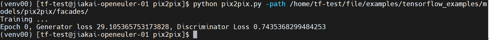

## models

> github:https://github.com/tensorflow/models

本次主要测试了该仓库下recommendation、nlp、vision和projects中的模型，首先克隆仓库并设置环境变量：

```
//克隆仓库
git clone https://github.com/tensorflow/models
//把models仓库添加到PYTHONPATH环境变量中
export PYTHONPATH="$PYTHONPATH:/home/tf-test/file/models"
```

### recommendation

recommendation中的模型在路径models/official/recommendation下。

#### NCF

NCF在[GitHub](https://github.com/tensorflow/models/tree/master/official/recommendation)上有下载并预处理数据集和训练与评估模型的步骤，具体如下，工作路径为models/official/recommendation/：

```
//下载并预处理数据集，这里选择ml-1m数据集
python movielens.py --data_dir /home/tf-test/models/dataset/ncf --dataset ml-1m
//训练与评估模型
python ncf_keras_main.py --model_dir /home/tf-test/models/model_dir/ncf --data_dir /home/tf-test/models/dataset/ncf/ --dataset ml-1m --num_gpus 0
```

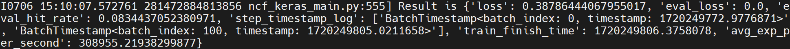

#### DCN v2

DCN v2在[GitHub](https://github.com/tensorflow/models/tree/master/official/recommendation/ranking)上有使用合成数据进行训练的步骤，具体如下：

```
python3 models/official/recommendation/ranking/train.py --mode=eval \
--model_dir=/home/tf-test/models/model_dir/dcn_v2 --params_override="
runtime:
    distribution_strategy: 'one_device'
task:
    use_synthetic_data: true
    model:
        num_dense_features: 13
        bottom_mlp: [512,256,2]
        embedding_dim: 2
        top_mlp: [1024,1024,512,256,1]
        interaction: 'cross'
        vocab_sizes: [39884406, 39043, 17289, 7420, 20263, 3, 7120, 1543, 63,
            38532951, 2953546, 403346, 10, 2208, 11938, 155, 4, 976, 14,
            39979771, 25641295, 39664984, 585935, 12972, 108, 36]
trainer:
    validation_steps: 2
"
```

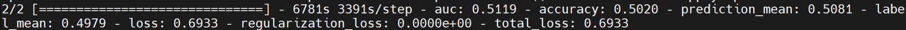

#### DLRM

DLRM在[GitHub](https://github.com/tensorflow/models/tree/master/official/recommendation/ranking)上有使用合成数据进行训练的步骤，具体如下：

```
python3 models/official/recommendation/ranking/train.py --mode=eval \
--model_dir=/home/tf-test/models/model_dir/dlrm --params_override="
runtime:
    distribution_strategy: 'one_device'
task:
    use_synthetic_data: true
    model:
        num_dense_features: 13
        bottom_mlp: [512,256,2]
        embedding_dim: 2
        top_mlp: [1024,1024,512,256,1]
        interaction: 'dot'
        vocab_sizes: [39884406, 39043, 17289, 7420, 20263, 3, 7120, 1543, 63,
            38532951, 2953546, 403346, 10, 2208, 11938, 155, 4, 976, 14,
            39979771, 25641295, 39664984, 585935, 12972, 108, 36]
trainer:
    validation_steps: 2
"
```

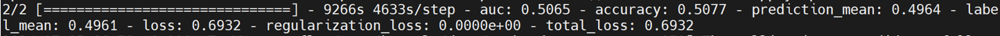

### nlp

nlp中的模型在路径models/official/nlp/下运行。

#### Transformer

Transformer在[GitHub](https://github.com/tensorflow/models/blob/master/official/nlp/MODEL_GARDEN.md#available-model-configs)上有说明文档，具体如下：

```
python train.py --experiment wmt_transformer/large  --mode eval --model_dir /home/tf-test/models/model_dir/transformer --params_override task.sentencepiece_model_path='gs://tf_model_garden/nlp/transformer_wmt/ende_bpe_32k.model'
```

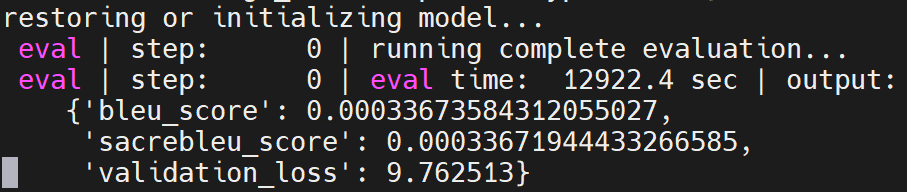

### vision

vision中的模型在路径models/official/vision/下运行。

在运行models之前，需要下载并预处理ILSVRC2012和coco2017数据集，具体操作[点击这里](https://github.com/6eanut/tensorflow_mydataset/blob/main/README.md)。最终把包含 `train*`和 `val*`的ILSVRC2012数据集文件夹重命名为 `imagenet-2012-tfrecord`并放在vision目录下；把包含 `val*`和 `instances_val2017.json`的coco2017数据集文件夹重命名为coco并放在vision目录下。

接着进行下面的模型运行。

#### vit_imagenet_finetune

是[image_classification](https://github.com/tensorflow/models/blob/master/official/vision/configs/image_classification.py)中的一个模型，具体测试方法如下：

```
python train.py -experiment vit_imagenet_finetune -mode eval -model_dir /home/tf-test/models/model_dir/vit_imagenet_finetune --params_override="
runtime:
    distribution_strategy: 'one_device'
task:
    validation_data:
        global_batch_size: 2
trainer:
    validation_steps: 2
    validation_interval: 2
"
```

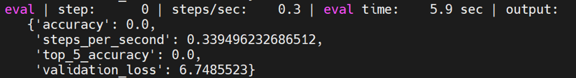

#### vit_imagenet_pretrain

是[image_classification](https://github.com/tensorflow/models/blob/master/official/vision/configs/image_classification.py)中的一个模型，具体测试方法如下：

```
python train.py -experiment vit_imagenet_pretrain  -mode eval -model_dir /home/tf-test/models/model_dir/vit_imagenet_pretrain --params_override="
runtime:
    distribution_strategy: 'one_device'
task:
    validation_data:
        global_batch_size: 2
trainer:
    validation_steps: 2
    validation_interval: 2
"
```

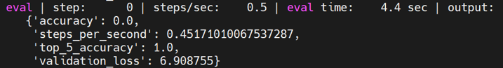

#### deit_imagenet_pretrain

是[image_classification](https://github.com/tensorflow/models/blob/master/official/vision/configs/image_classification.py)中的一个模型，具体测试方法如下：

```
python train.py -experiment deit_imagenet_pretrain -mode eval -model_dir /home/tf-test/models/model_dir/deit_imagenet_pretrain --params_override="
runtime:
    distribution_strategy: 'one_device'
task:
    validation_data:
        global_batch_size: 2
trainer:
    validation_steps: 2
    validation_interval: 2
"
```

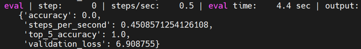

#### mobilenet_imagenet

是[image_classification](https://github.com/tensorflow/models/blob/master/official/vision/configs/image_classification.py)中的一个模型，具体测试方法如下：

```
python train.py -experiment mobilenet_imagenet -mode eval -model_dir /home/tf-test/models/model_dir/mobilenet_imagenet --params_override="
runtime:
    distribution_strategy: 'one_device'
task:
    validation_data:
        global_batch_size: 2
trainer:
    validation_steps: 2
    validation_interval: 2
"
```

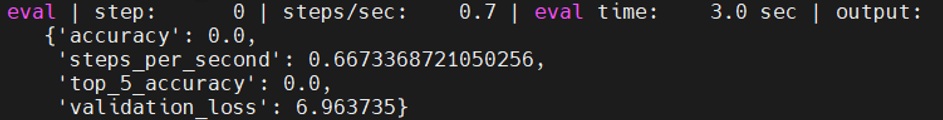

#### revnet_imagenet

是[image_classification](https://github.com/tensorflow/models/blob/master/official/vision/configs/image_classification.py)中的一个模型，具体测试方法如下：

```
python train.py -experiment revnet_imagenet -mode eval -model_dir /home/tf-test/models/model_dir/revnet_imagenet --params_override="
runtime:
    distribution_strategy: 'one_device'
task:
    validation_data:
        global_batch_size: 2
trainer:
    validation_steps: 2
    validation_interval: 2
"
```

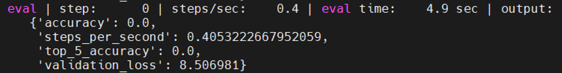

#### resnet_rs_imagenet

是[image_classification](https://github.com/tensorflow/models/blob/master/official/vision/configs/image_classification.py)中的一个模型，具体测试方法如下：

```
python train.py -experiment resnet_rs_imagenet -mode eval -model_dir /home/tf-test/models/model_dir/resnet_rs_imagenet --params_override="
runtime:
    distribution_strategy: 'one_device'
task:
    validation_data:
        global_batch_size: 2
trainer:
    validation_steps: 2
    validation_interval: 2
"
```

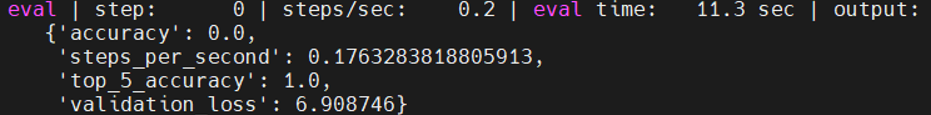

#### resnet_imagenet

是[image_classification](https://github.com/tensorflow/models/blob/master/official/vision/configs/image_classification.py)中的一个模型，具体测试方法如下：

```
python train.py -experiment resnet_imagenet -mode eval -model_dir /home/tf-test/models/model_dir/resnet_imagenet --params_override="
runtime:
    distribution_strategy: 'one_device'
task:
    validation_data:
        global_batch_size: 2
trainer:
    validation_steps: 2
    validation_interval: 2
"
```

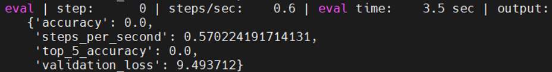

#### fasterrcnn_resnetfpn_coco

是[maskrcnn](https://github.com/tensorflow/models/blob/master/official/vision/configs/maskrcnn.py)中的一个模型，具体测试方法如下：

```
python train.py -experiment fasterrcnn_resnetfpn_coco -mode eval -model_dir /home/tf-test/models/model_dir/fasterrcnn_resnetfpn_coco --params_override="
runtime:
    distribution_strategy: 'one_device'
task:
    validation_data:
        global_batch_size: 2
trainer:
    validation_steps: 2
    validation_interval: 2
"
```

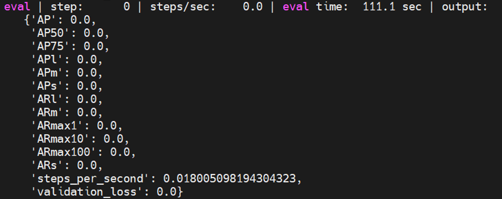

#### maskrcnn_resnetfpn_coco

是[maskrcnn](https://github.com/tensorflow/models/blob/master/official/vision/configs/maskrcnn.py)中的一个模型，具体测试方法如下：

```
python train.py -experiment maskrcnn_resnetfpn_coco -mode eval -model_dir /home/tf-test/models/model_dir/maskrcnn_resnetfpn_coco --params_override="
runtime:
    distribution_strategy: 'one_device'
task:
    validation_data:
        global_batch_size: 2
trainer:
    validation_steps: 2
    validation_interval: 2
"
```

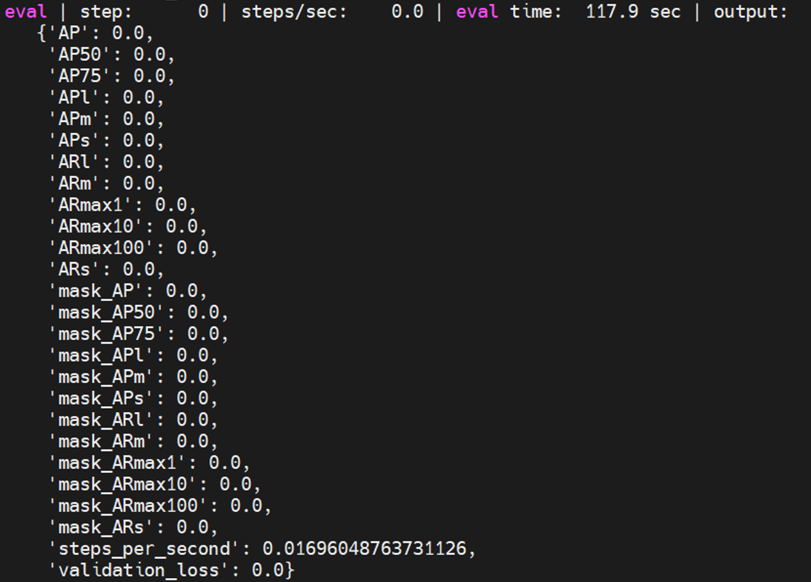

#### maskrcnn_spinenet_coco

是[maskrcnn](https://github.com/tensorflow/models/blob/master/official/vision/configs/maskrcnn.py)中的一个模型，具体测试方法如下：

```
python train.py -experiment maskrcnn_spinenet_coco -mode eval -model_dir /home/tf-test/models/model_dir/maskrcnn_spinenet_coco --params_override="
runtime:
    distribution_strategy: 'one_device'
task:
    validation_data:
        global_batch_size: 2
trainer:
    validation_steps: 2
    validation_interval: 2
" 
```

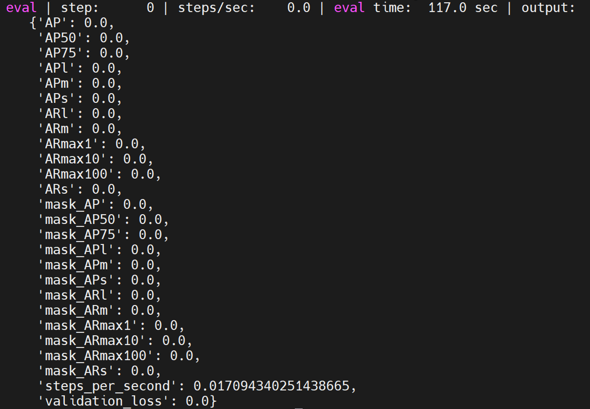

#### cascadercnn_spinenet_coco

是[maskrcnn](https://github.com/tensorflow/models/blob/master/official/vision/configs/maskrcnn.py)中的一个模型，具体测试方法如下：

```
python train.py -experiment cascadercnn_spinenet_coco -mode eval -model_dir /home/tf-test/models/model_dir/cascadercnn_spinenet_coco --params_override="
runtime:
    distribution_strategy: 'one_device'
task:
    validation_data:
        global_batch_size: 2
trainer:
    validation_steps: 2
    validation_interval: 2
"
```

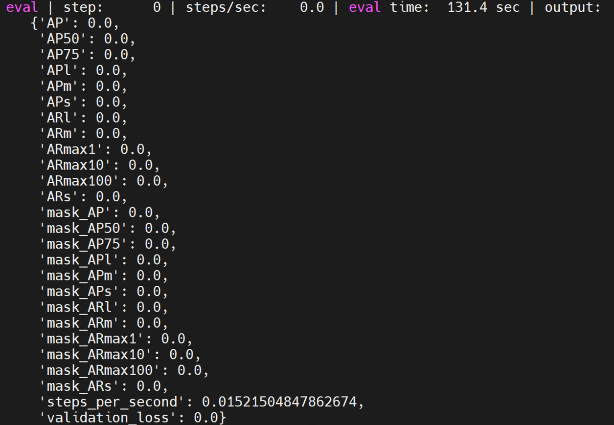

#### maskrcnn_mobilenet_coco

是[maskrcnn](https://github.com/tensorflow/models/blob/master/official/vision/configs/maskrcnn.py)中的一个模型，具体测试方法如下：

```
python train.py -experiment maskrcnn_mobilenet_coco -mode eval -model_dir /home/tf-test/models/model_dir/maskrcnn_mobilenet_coco --params_override="
runtime:
    distribution_strategy: 'one_device'
task:
    validation_data:
        global_batch_size: 2
trainer:
    validation_steps: 2
    validation_interval: 2
"
```

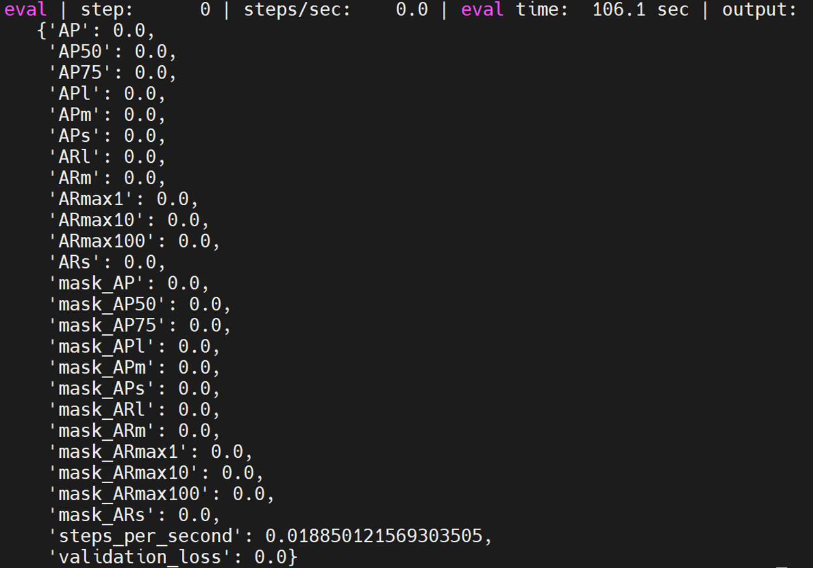

#### retinanet_resnetfpn_coco

是[retinanet](https://github.com/tensorflow/models/blob/master/official/vision/configs/retinanet.py)中的一个模型，具体测试方法如下：

```
python train.py -experiment retinanet_resnetfpn_coco -mode eval -model_dir /home/tf-test/models/model_dir/retinanet_resnetfpn_coco --params_override="
runtime:
    distribution_strategy: 'one_device'
task:
    validation_data:
        global_batch_size: 2
trainer:
    validation_steps: 2
    validation_interval: 2
"
```

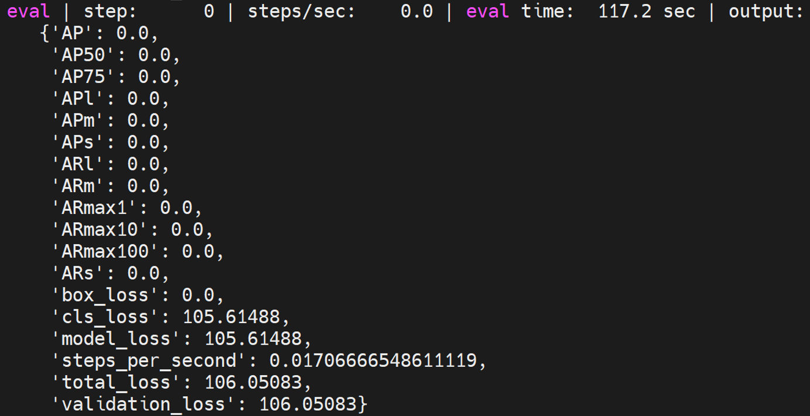

#### retinanet_spinenet_coco

是[retinanet](https://github.com/tensorflow/models/blob/master/official/vision/configs/retinanet.py)中的一个模型，具体测试方法如下：

```
python train.py -experiment retinanet_spinenet_coco -mode eval -model_dir /home/tf-test/models/model_dir/retinanet_spinenet_coco --params_override="
runtime:
    distribution_strategy: 'one_device'
task:
    validation_data:
        global_batch_size: 2
trainer:
    validation_steps: 2
    validation_interval: 2
"
```

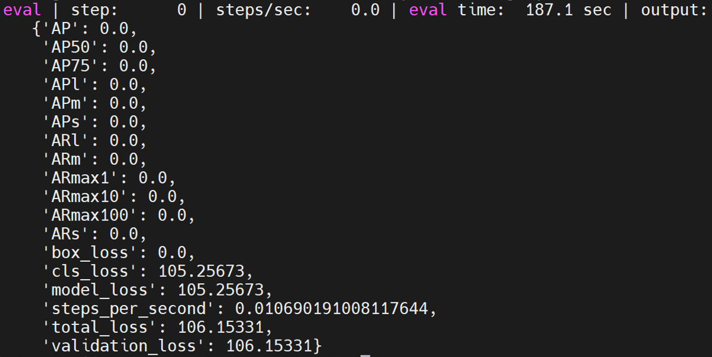

#### retinanet_mobile_coco

是[retinanet](https://github.com/tensorflow/models/blob/master/official/vision/configs/retinanet.py)中的一个模型，具体测试方法如下：

```
python train.py -experiment retinanet_mobile_coco -mode eval -model_dir /home/tf-test/models/model_dir/retinanet_mobile_coco --params_override="
runtime:
    distribution_strategy: 'one_device'
task:
    validation_data:
        global_batch_size: 2
trainer:
    validation_steps: 2
    validation_interval: 2
"
```

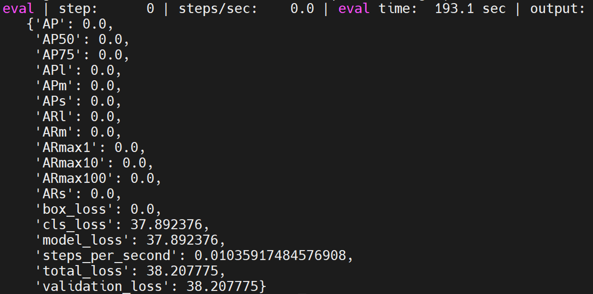

### projects

projects中的模型在路径models/official/projects/下。

#### **assemblenet**

GitHub中的[说明](https://github.com/tensorflow/models/tree/master/official/projects/assemblenet)，具体eval如下：

```
python train_test.py
```

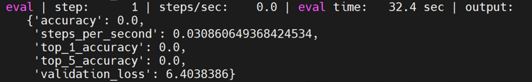

#### **volumetric_models**

GitHub中的[说明](https://github.com/tensorflow/models/tree/master/official/projects/volumetric_models)，具体eval如下：

```
python train_test.py
```

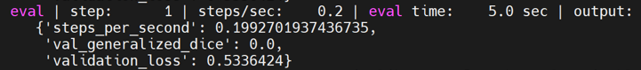

#### **nhnet**

GitHub中的[说明](https://github.com/tensorflow/models/tree/master/official/projects/nhnet)，具体eval如下：

```
python trainer_test.py
```

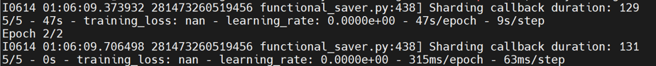

#### **yt8m**

GitHub中的[说明](https://github.com/tensorflow/models/tree/master/official/projects/yt8m)，具体eval如下：

```
python train_test.py
```

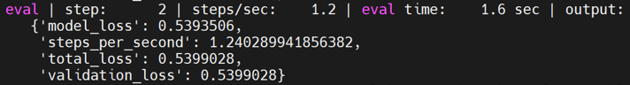

##### **movient**

GitHub中的[说明](https://github.com/tensorflow/models/tree/master/official/projects/movinet)，具体eval如下：

```
python train_test.py
```

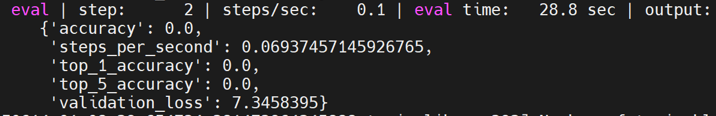

#### **maxvit**

GitHub中的[说明](https://github.com/tensorflow/models/tree/master/official/projects/maxvit)，具体eval如下：

```
python train_test.py
```

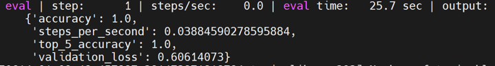

## benchmark

> github:https://github.com/tensorflow/benchmarks

benchmark模型需要克隆benchmark仓库，并且把上面克隆的models仓库切换到带有benchmark模块的v2.15.0tags，具体如下：

```
git clone https://github.com/tensorflow/benchmarks
cd models
git checkout v2.15.0
```

### resnet56

resnet56在models/official/benchmark/keras_cifar_benchmark.py文件中，这里采用合成数据进行测试，其自带benchmark_cpu，所以可以直接进行测试，如下：

```
python3 benchmarks/perfzero/lib/benchmark.py --git_repos="https://github.com/tensorflow/models.git;benchmark" --gcloud_key_file_url="" --benchmark_methods=official.benchmark.keras_cifar_benchmark.Resnet56KerasBenchmarkSynth.benchmark_cpu
```

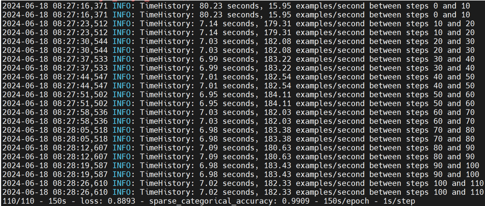

### resnet50

resnet50在models/official/benchmark/keras_imagenet_benchmark.py文件中，这里采用合成数据进行测试，其自带benchmark_1_gpu，当程序运行时会检测是否存在可用的gpu，若不存在则会使用cpu进行测试，所以可以直接进行测试，如下：

注：可以通过修改keras_imagenet_benchmark.py文件中KerasClassifierBenchmarkBase类中的benchmark_1_gpu方法的per_replica_batch_size值来减小batch_size以缩短测试时间。

```
python3 benchmarks/perfzero/lib/benchmark.py --git_repos="https://github.com/tensorflow/models.git;benchmark" --gcloud_key_file_url="" --benchmark_methods=official.benchmark.keras_imagenet_benchmark.Resnet50KerasBenchmarkSynth.benchmark_1_gpu
```

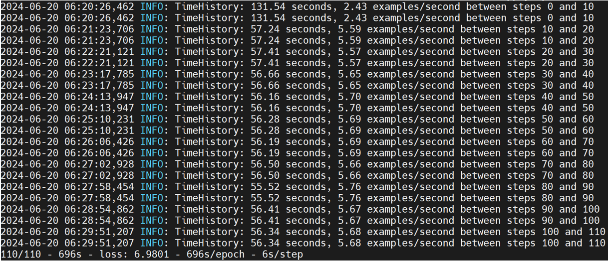

### mobilenetv1

mobilenetv1在models/official/benchmark/keras_imagenet_benchmark.py文件中，为了方便测试，这里选择使用合成数据，所以需要自己写相应的KerasPruningBenchmarkSynthBase和MobilenetV1KerasPruningBenchmarkSynth类，具体如下：

```
class KerasPruningBenchmarkSynthBase(Resnet50KerasBenchmarkBase):
  """Pruning method benchmarks."""

  def __init__(self, root_data_dir=None, default_flags=None, **kwargs):
    if default_flags is None:
      default_flags = {}
    default_flags.update({
        'skip_eval': True,
        'report_accuracy_metrics': False,
        'use_synthetic_data': True,
        'train_steps': 110,
        'log_steps': 10,
        'pruning_method': 'polynomial_decay',
        'pruning_begin_step': 0,
        'pruning_end_step': 50000,
        'pruning_initial_sparsity': 0,
        'pruning_final_sparsity': 0.5,
        'pruning_frequency': 100,
    })
    super(KerasPruningBenchmarkSynthBase, self).__init__(
        default_flags=default_flags, **kwargs)

class MobilenetV1KerasPruningBenchmarkSynth(KerasPruningBenchmarkSynthBase):
  """Pruning method benchmarks for MobilenetV1."""

  def __init__(self, **kwargs):
    default_flags = {
        'model': 'mobilenet',
        'optimizer': 'mobilenet_default',
    }
    super(MobilenetV1KerasPruningBenchmarkSynth, self).__init__(
        default_flags=default_flags, **kwargs)
```

同样可以调整batch_size来缩短测试时间。

```
python3 benchmarks/perfzero/lib/benchmark.py --git_repos="https://github.com/tensorflow/models.git;benchmark" --gcloud_key_file_url="" --benchmark_methods=official.benchmark.keras_imagenet_benchmark.MobilenetV1KerasPruningBenchmarkSynth.benchmark_1_gpu
```

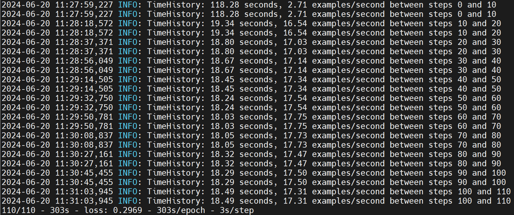

### trivial

trivial在models/official/benchmark/keras_imagenet_benchmark.py文件中，为了方便测试，这里选择使用合成数据，所以需要自己写相应的TrivialKerasBenchmarkSynth类，具体如下：

```
class TrivialKerasBenchmarkSynth(keras_benchmark.KerasBenchmark):
  """Trivial model with synth data benchmark tests."""

  def __init__(self, output_dir=None, root_data_dir=None, **kwargs):
    flag_methods = [resnet_imagenet_main.define_imagenet_keras_flags]

    def_flags = {}
    def_flags['use_trivial_model'] = True
    def_flags['skip_eval'] = True
    def_flags['report_accuracy_metrics'] = False
    def_flags['dtype'] = 'fp16'
    def_flags['use_synthetic_data'] = True
    def_flags['train_steps'] = 600
    def_flags['log_steps'] = 100
    def_flags['distribution_strategy'] = 'mirrored'

    super(TrivialKerasBenchmarkSynth, self).__init__(
        output_dir=output_dir,
        flag_methods=flag_methods,
        default_flags=def_flags)

  @benchmark_wrappers.enable_runtime_flags
  def _run_and_report_benchmark(self):
    start_time_sec = time.time()
    stats = resnet_imagenet_main.run(FLAGS)
    wall_time_sec = time.time() - start_time_sec

    super(TrivialKerasBenchmarkSynth, self)._report_benchmark(
        stats,
        wall_time_sec,
        total_batch_size=FLAGS.batch_size,
        log_steps=FLAGS.log_steps)

  def benchmark_cpu(self):
    self._setup()

    FLAGS.num_gpus = 0
    FLAGS.enable_eager = True
    FLAGS.model_dir = self._get_model_dir('benchmark_cpu')
    FLAGS.batch_size = 32
    FLAGS.train_steps = 10
    self._run_and_report_benchmark()

  def fill_report_object(self, stats):
    super(TrivialKerasBenchmarkSynth, self).fill_report_object(
        stats,
        total_batch_size=FLAGS.batch_size,
        log_steps=FLAGS.log_steps)

```

```
python3 benchmarks/perfzero/lib/benchmark.py --git_repos="https://github.com/tensorflow/models.git;benchmark" --gcloud_key_file_url="" --benchmark_methods=official.benchmark.keras_imagenet_benchmark.TrivialKerasBenchmarkSynth.benchmark_cpu
```

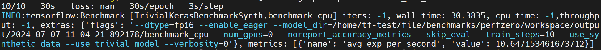

### efficientnet

efficientnet在models/official/benchmark/keras_imagenet_benchmark.py文件中，为了方便测试，这里选择使用合成数据，所以需要自己写相应的EfficientNetKerasBenchmarkSynth类，具体如下：

```
class EfficientNetKerasBenchmarkSynth(KerasClassifierBenchmarkBase):
  """EfficientNet synth data benchmark tests."""

  def __init__(self, output_dir=None, root_data_dir=None, tpu=None, **kwargs):
    def_flags = {}
    def_flags['log_steps'] = 10

    super(EfficientNetKerasBenchmarkSynth, self).__init__(
        model='efficientnet', output_dir=output_dir, default_flags=def_flags,
        tpu=tpu, dataset_builder='synthetic', train_epochs=1, train_steps=110)

  def benchmark_cpu(self):
    self._setup()
    self._run_and_report_benchmark(
        experiment_name='benchmark_cpu',
        model_variant='efficientnet-b7',
        dtype='bfloat16',
        num_tpus=0,
        distribution_strategy='one_device',
        per_replica_batch_size=4)
```

```
python3 benchmarks/perfzero/lib/benchmark.py --git_repos="https://github.com/tensorflow/models.git;benchmark" --gcloud_key_file_url="" --benchmark_methods=official.benchmark.keras_imagenet_benchmark.EfficientNetKerasBenchmarkSynth.benchmark_cpu
```

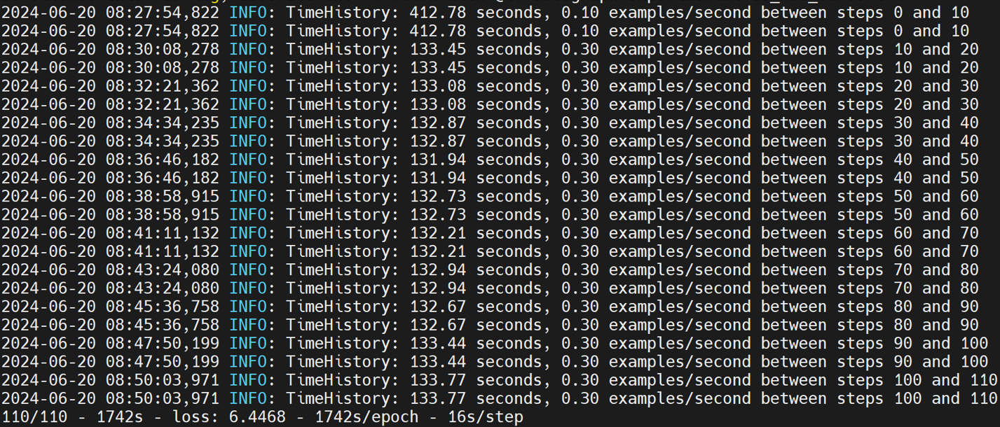

### resnet50ctl

resnet50ctl在models/official/benchmark/resnet_ctl_imagenet_benchmark.py文件中，这里采用合成数据进行测试，其自带benchmark_1_gpu，当程序运行时会检测是否存在可用的gpu，若不存在则会使用cpu进行测试，所以可以直接进行测试，如下：

另外需要将Resnet50CtlBenchmarkBase类中的benchmark_1_gpu方法的batch_size改为32，否则会出现RAM不够用的问题。

```
python3 benchmarks/perfzero/lib/benchmark.py --git_repos="https://github.com/tensorflow/models.git;benchmark" --gcloud_key_file_url="" --benchmark_methods=official.benchmark.resnet_ctl_imagenet_benchmark.Resnet50CtlBenchmarkSynth.benchmark_1_gpu
```

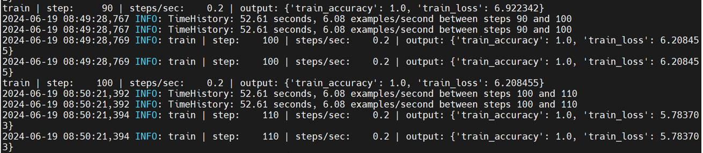

### TfScanE2E

测试和评估TensorFlow模型整体端到端性能的基准测试。

TFScanE2E在models/official/benchamrk/tf_scan_benchmark.py文件中，有自带的benchmark_cpu，具体如下：

```
python3 benchmarks/perfzero/lib/benchmark.py --git_repos="https://github.com/tensorflow/models.git;benchmark" --gcloud_key_file_url="" --benchmark_methods=official.benchmark.tf_scan_benchmark.TfScanE2EBenchmark.benchmark_cpu
```

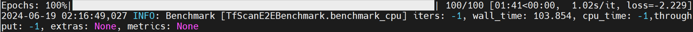

## others

这里是一些小的test。

### **tensorflow_models**

工作路径：/home/tf-test/file/models/tensorflow_models

```
python tensorflow_models_test.py
```

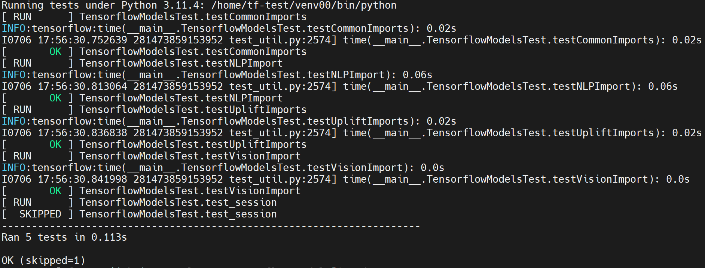

### **orbit**

工作路径：/home/tf-test/file/models/orbit/examples/single_task

```
python single_task_trainer_test.py
```

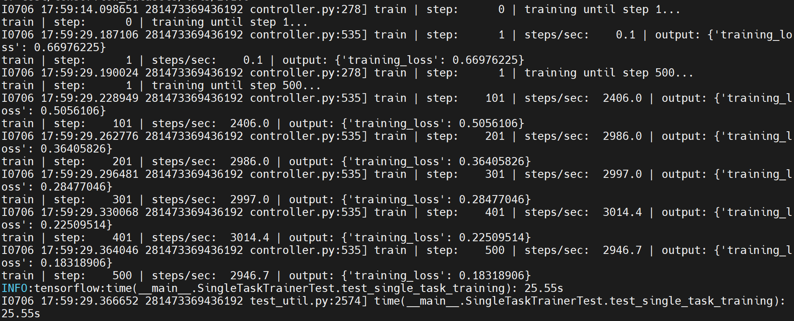

```
python single_task_evaluator_test.py
```

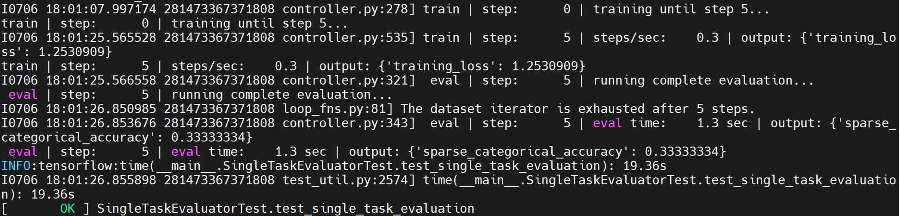
